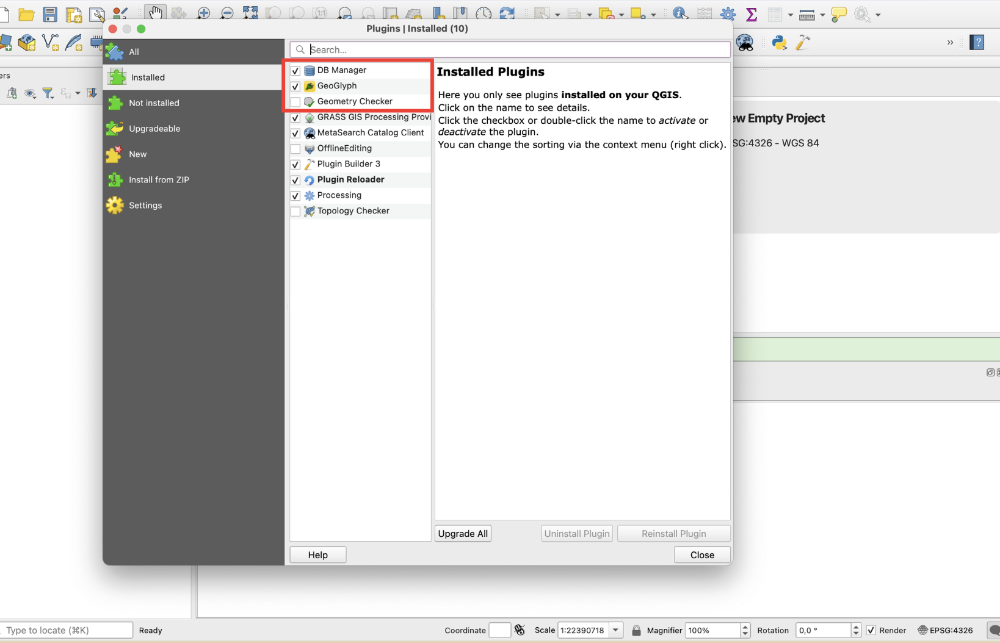
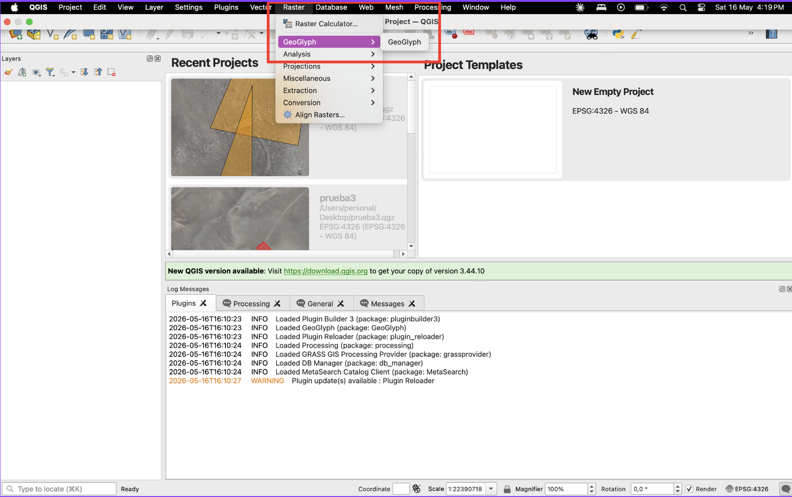
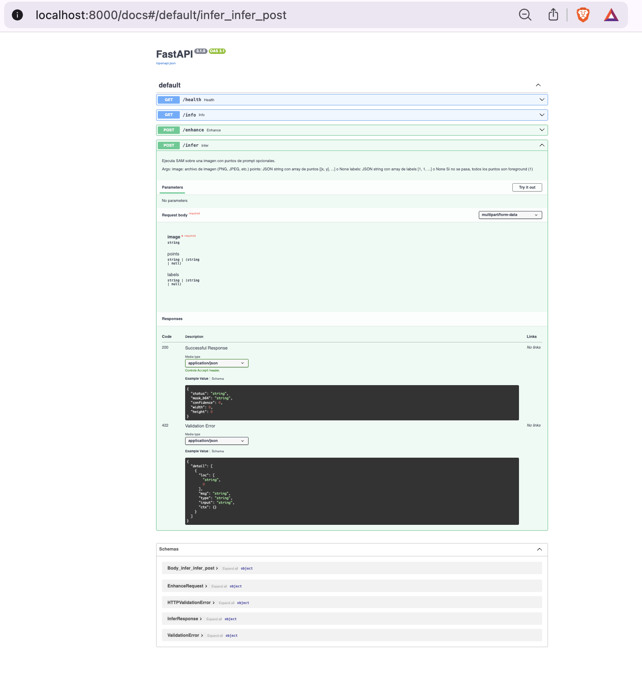
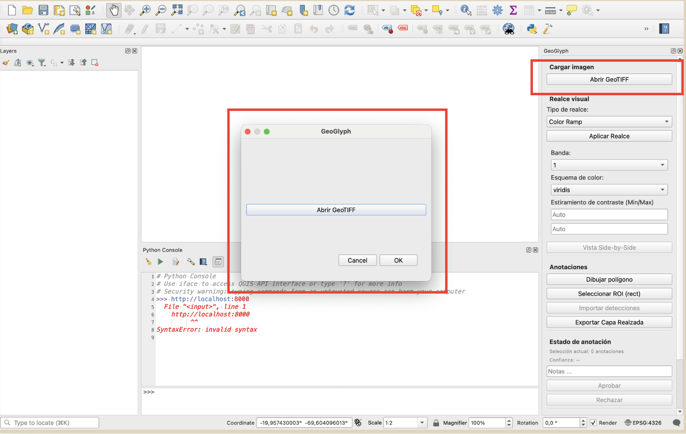
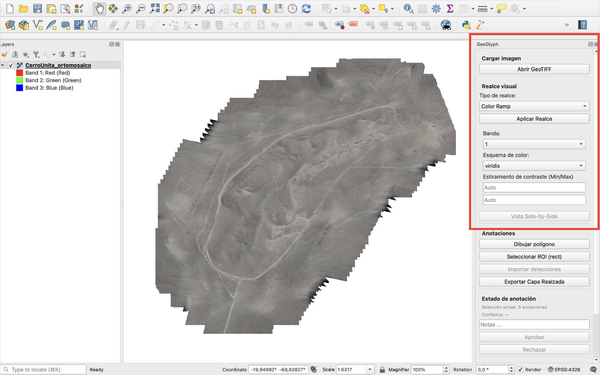
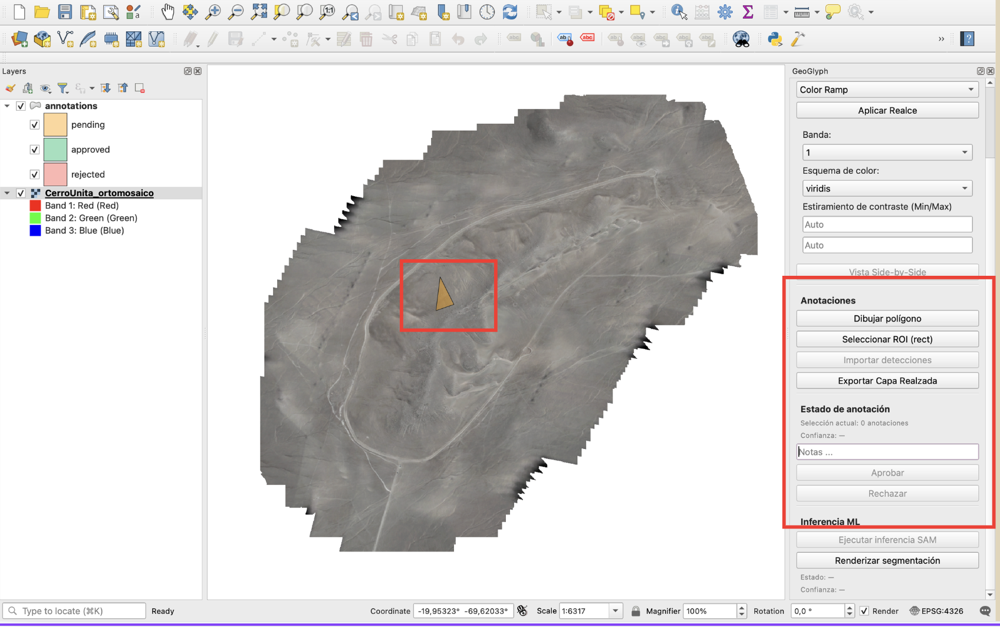
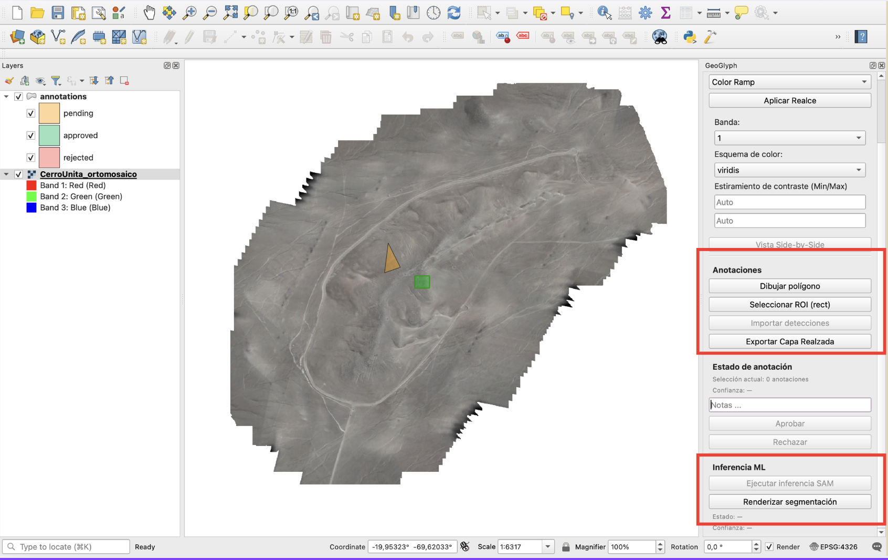

# GeoGlyph — Guía de Instalación y Uso

> Plataforma de Anotación Asistida para Geoglifos  
> Proyecto de Título DCC — CENIA / EAA_UC  
> Versión: 1.0 | Mayo 2026

---

## Tabla de Contenidos

1. [Descripción general](#1-descripción-general)
2. [Requisitos del sistema](#2-requisitos-del-sistema)
3. [Instalación del plugin en QGIS](#3-instalación-del-plugin-en-qgis)
4. [Levantar el backend de inferencia](#4-levantar-el-backend-de-inferencia)
5. [Flujo básico de uso con el dataset demo](#5-flujo-básico-de-uso-con-el-dataset-demo)
6. [Limitaciones conocidas](#6-limitaciones-conocidas)
7. [Resolución de problemas comunes](#7-resolución-de-problemas-comunes)

---

## 1. Descripción general

**GeoGlyph** es un plugin para QGIS que asiste a investigadores y arqueólogos en la anotación de geoglifos en imágenes aéreas de alta resolución (GeoTIFF / ortomosaicos). Combina herramientas de anotación manual con inferencia automática mediante el modelo **SAM** (*Segment Anything Model*), siguiendo el paradigma *human-in-the-loop*: el modelo propone una máscara inicial que el experto valida, corrige o rechaza.

Las funcionalidades principales son:

- Carga y visualización de capas raster georreferenciadas (GeoTIFF / ortomosaico).
- Anotación manual mediante polígonos, líneas y puntos.
- Segmentación asistida por IA: el usuario selecciona una región de interés (ROI) y el sistema genera una máscara automática refinable.
- Realce arqueológico de imágenes: aplicación de *Color Ramp* y *DStretch* sobre capas ráster.
- Importación y validación de detecciones externas generadas por modelos ML.
- Persistencia de anotaciones en formato GeoPackage (`.gpkg`) con trazabilidad completa.

> **Nota:** Si no está disponible el backend de inferencia (SAM), el plugin opera en modo anotación manual sin interrupciones.

---

## 2. Requisitos del sistema

### 2.1 Máquina del investigador (plugin QGIS)

| Componente | Mínimo | Recomendado |
|---|---|---|
| Sistema operativo | Windows 10/11, macOS 12+, Ubuntu 20.04+ | Ubuntu 22.04+ o Windows 11 |
| CPU | Intel Core i5 8ª gen. o equivalente (x86-64) | Intel Core i7 o AMD Ryzen 7 |
| RAM | 8 GB | 16 GB (para ortomosaicos de gran tamaño) |
| Almacenamiento libre | 20 GB | 40 GB (SSD recomendado para lectura de GeoTIFFs) |
| Python | 3.9+ | 3.11 |
| QGIS | 3.x | 3.34 LTS |
| GDAL | 3.x | — |
| PyQt5 | 5.x | — |

### 2.2 Máquina del backend de inferencia (FastAPI + SAM)

| Componente | Mínimo | Recomendado |
|---|---|---|
| Sistema operativo | Windows 10/11 | Linux (Ubuntu 20.04+) |
| CPU | Intel Core i7 / AMD Ryzen 7 | — |
| RAM | 8 GB | 16 GB |
| Almacenamiento libre | 10 GB | 15 GB (pesos SAM: ~2.5 GB `vit_h`, ~375 MB `vit_b`) |
| Python | 3.9+ | 3.11 |
| PyTorch | 2.x | — |
| FastAPI | 0.x | — |

### 2.3 Fuentes de datos externas

- Acceso a red con ancho de banda suficiente para transferir archivos GeoTIFF (pueden superar varios GB por imagen).
- Las imágenes demo del repositorio son de tamaño reducido y no requieren infraestructura especial.

---

## 3. Instalación del plugin en QGIS

### Paso 1 — Clonar el repositorio

```bash
git clone https://github.com/<org>/geoglyph.git
cd geoglyph
```

### Paso 2 — Instalar dependencias del plugin

```bash
pip install -r plugin/requirements.txt
```

Las dependencias principales son: `gdal`, `rasterio`, `shapely`, `aiohttp`.

### Paso 3 — Copiar el plugin al directorio de QGIS

Copiar la carpeta `plugin/geoglyph/` al directorio de plugins de QGIS según el sistema operativo:

| Sistema operativo | Ruta del directorio de plugins |
|---|---|
| Windows | `C:\Users\<usuario>\AppData\Roaming\QGIS\QGIS3\profiles\default\python\plugins\` |
| macOS | `~/Library/Application Support/QGIS/QGIS3/profiles/default/python/plugins/` |
| Linux | `~/.local/share/QGIS/QGIS3/profiles/default/python/plugins/` |

<!-- CAPTURA 1: Screenshot del explorador de archivos mostrando la carpeta geoglyph/ correctamente copiada dentro del directorio de plugins de QGIS en el sistema operativo correspondiente. -->


### Paso 4 — Activar el plugin en QGIS

1. Abrir QGIS.
2. Ir al menú **Complementos → Administrar e instalar complementos**.
3. En la pestaña **Instalados**, buscar **GeoGlyph**.
4. Marcar la casilla para activarlo y hacer clic en **Cerrar**.

<!-- CAPTURA 2: Screenshot del administrador de complementos de QGIS con GeoGlyph visible en la lista y la casilla de activación marcada. -->


### Paso 5 — Verificar la instalación

Una vez activado, el plugin debe aparecer en el menú **Ráster → GeoGlyph** de la barra superior de QGIS.

<!-- CAPTURA 3: Screenshot del menú superior de QGIS abierto en la sección Ráster, donde se ve la opción GeoGlyph disponible. -->

---

## 4. Levantar el backend de inferencia

> **Este paso es opcional.** Si no se dispone del hardware necesario, el plugin funciona en modo anotación manual.

### Paso 1 — Instalar dependencias del backend

```bash
cd backend
pip install -r requirements.txt
```

Las dependencias principales son: `fastapi`, `uvicorn`, `torch`, `rasterio`, `shapely`, `pydantic`.

### Paso 2 — Descargar los pesos del modelo SAM

```bash
# Versión ligera (~375 MB) — recomendada para pruebas
python scripts/download_sam_weights.py --variant vit_b

# Versión completa (~2.5 GB) — mayor precisión
python scripts/download_sam_weights.py --variant vit_h
```

Los pesos se descargarán automáticamente en la carpeta `backend/weights/`.

### Paso 3 — Iniciar el servidor

```bash
uvicorn app.main:app --host 0.0.0.0 --port 8000 --reload
```

### Paso 4 — Verificar que el servidor esté activo

Abrir el navegador y navegar a `http://localhost:8000/docs`. Debe aparecer la documentación interactiva de la API (Swagger UI).

<!-- CAPTURA 4: Screenshot del navegador mostrando la interfaz Swagger UI en http://localhost:8000/docs con los endpoints /infer y /import visibles. -->



---

## 5. Flujo básico de uso con el dataset demo

El repositorio incluye un dataset de prueba en `docs/demo_data/` con imágenes GeoTIFF de baja resolución de sitios arqueológicos del norte de Chile.

### Paso 1 — Abrir QGIS y cargar una imagen GeoTIFF

1. Abrir QGIS.
2. Ir al menú **Ráster → GeoGlyph**.
3. El panel lateral de GeoGlyph se desplegará a la derecha de la pantalla, mostrando las herramientas disponibles.
4. Con el botón **Abrir GeoTiff** selecciona un archivo `.tiff`

<!-- CAPTURA 6: Screenshot de QGIS con la imagen GeoTIFF demo cargada y visible en el mapa, mostrando la ortofoto aérea de un sitio arqueológico del norte de Chile. -->



### Paso 2 — Aplicar realce arqueológico (opcional)

Para mejorar la visibilidad de los geoglifos:

1. En el panel de GeoGlyph, ir a la sección **Realce de imagen**.
2. Seleccionar la técnica deseada: **Color Ramp** o **DStretch**.
3. Hacer clic en **Aplicar**. La imagen se actualizará en el mapa con el realce seleccionado.

<!-- CAPTURA 8: Screenshot comparativo o único mostrando la imagen antes y después de aplicar DStretch o Color Ramp, donde se observe una mejora en la visibilidad de estructuras sobre la superficie del terreno. -->



### Paso 3 — Crear una anotación manual

1. En el panel de GeoGlyph, seleccionar la herramienta **Anotación manual → Polígono**.
2. Hacer clic sobre el mapa para trazar el contorno del geoglifo.
3. Hacer doble clic para cerrar el polígono.
4. En el formulario que aparece, ingresar la etiqueta (ej. `geoglifo`, `figura_humana`) y el estado (`pending`).
5. Hacer clic en **Guardar**. La anotación quedará registrada en el GeoPackage.

<!-- CAPTURA 9: Screenshot de QGIS durante el proceso de anotación manual, mostrando un polígono en proceso de dibujo sobre una figura visible en el ortomosaico, con el formulario de metadatos de la anotación abierto. -->


### Paso 4 — Segmentación asistida por IA (requiere backend activo)

1. En el panel de GeoGlyph, seleccionar la herramienta **Segmentación asistida**.
2. Hacer clic y arrastrar sobre el mapa para definir una región de interés (ROI) alrededor del geoglifo.
3. El plugin enviará la ROI al backend (POST `/infer`). En 2–10 segundos, la máscara generada por SAM aparecerá como una nueva capa sobre el mapa.
4. Si la máscara no es satisfactoria, ajustar los puntos de prompt y hacer clic en **Refinar** para generar una nueva máscara.
5. Una vez satisfecho, hacer clic en **Aprobar** para guardar la anotación, o **Rechazar** para descartarla.

<!-- CAPTURA 10: Screenshot de QGIS mostrando el resultado de la segmentación asistida: la máscara generada por SAM superpuesta sobre el ortomosaico como capa semitransparente, con el contorno del geoglifo claramente delimitado, y los botones de Aprobar / Rechazar / Refinar visibles en el panel. -->


### Paso 5 — Revisar y exportar anotaciones

1. En el panel de GeoGlyph, ir a la sección **Anotaciones**.
2. La tabla mostrará todas las anotaciones guardadas con su estado (`pending`, `approved`, `rejected`), tipo (`ml-annotation`, `human-annotation`) y score de confianza (si aplica).
3. Para exportar, hacer clic en **Exportar GeoPackage** y seleccionar la ruta de destino.

<!-- CAPTURA 11: Screenshot del panel de GeoGlyph mostrando la tabla de anotaciones con al menos una anotación manual y una de tipo ml-annotation, con sus campos de estado, tipo y score visibles. -->


---

## 6. Limitaciones conocidas

- El plugin ha sido probado con imágenes GeoTIFF de hasta **500 MB**. Ortomosaicos de mayor tamaño pueden presentar degradación de rendimiento.
- La segmentación asistida requiere que el backend esté corriendo **en la misma red local** o de forma accesible vía HTTP. No se incluye autenticación en esta versión.
- Los pesos `vit_h` de SAM requieren al menos **16 GB de RAM** en la máquina del backend para operar sin problemas.
- Esta versión del plugin no incluye soporte para **múltiples usuarios simultáneos** sobre el mismo GeoPackage.
- El plugin no reemplaza el juicio experto del arqueólogo: todas las anotaciones generadas por el modelo deben ser validadas manualmente antes de considerarse definitivas.

---

## 7. Resolución de problemas comunes

### El plugin no aparece en el menú Ráster de QGIS

Verificar que la carpeta `geoglyph/` esté en el directorio correcto de plugins (ver [Paso 3 de instalación](#paso-3--copiar-el-plugin-al-directorio-de-qgis)) y que el plugin esté marcado como activo en **Complementos → Administrar e instalar complementos**.

### Error al cargar el GeoTIFF: `GDAL not found`

Asegurarse de que GDAL esté instalado y disponible en el entorno de Python que usa QGIS. En sistemas Linux:

```bash
sudo apt install gdal-bin python3-gdal
```

### El backend no responde (timeout al intentar segmentación)

1. Verificar que el servidor esté corriendo: `http://localhost:8000/docs` debe ser accesible desde el navegador.
2. Revisar que la URL ingresada en la configuración del plugin sea correcta (sin `/` al final).
3. Revisar los logs del terminal donde se ejecuta `uvicorn` en busca de errores.

### La máscara generada por SAM no cubre el geoglifo correctamente

- Intentar ajustar los puntos de prompt de SAM (mover el punto central de la ROI más cerca del centro del geoglifo).
- Usar la variante `vit_h` del modelo para mayor precisión (requiere más recursos).
- Aplicar un realce de imagen (DStretch) antes de realizar la segmentación para mejorar el contraste.

### Las anotaciones no se guardan

Verificar que el archivo `.gpkg` de destino no esté abierto por otro proceso y que la ruta tenga permisos de escritura.

---

*Documento generado como parte del Sprint 4 — TIGS-87*  
*Responsable: Javiera Paz Larraín Morales*  
*Proyecto GeoGlyph — Taller de Integración, DCC PUC — Mayo 2026*
