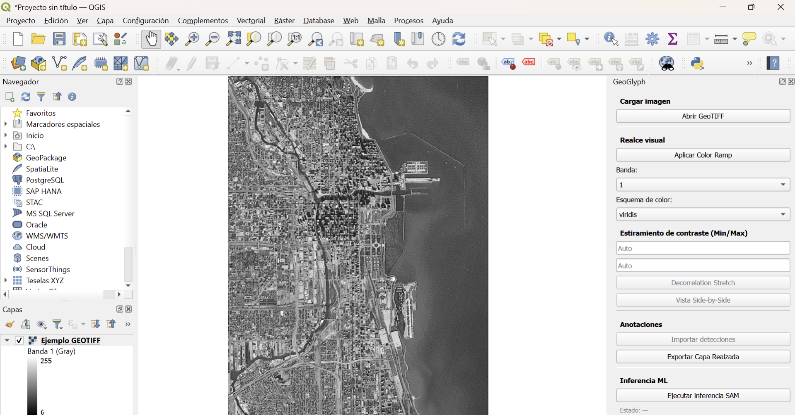
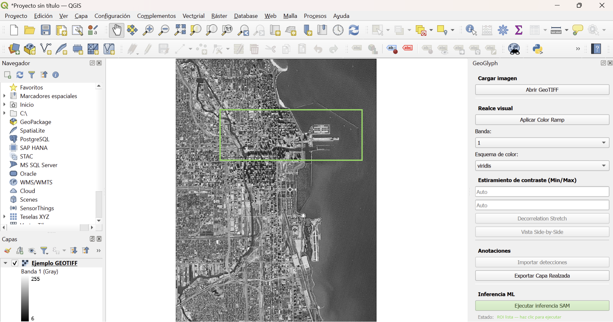
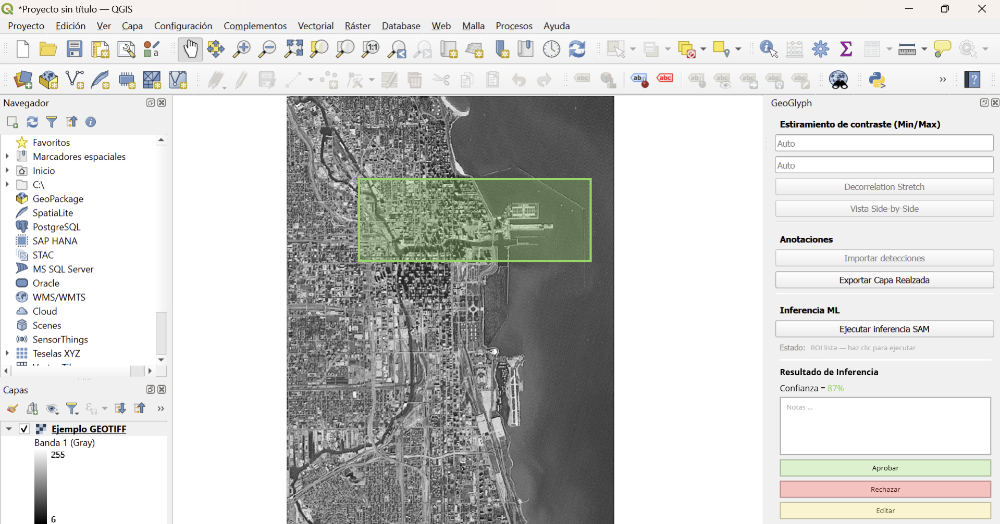
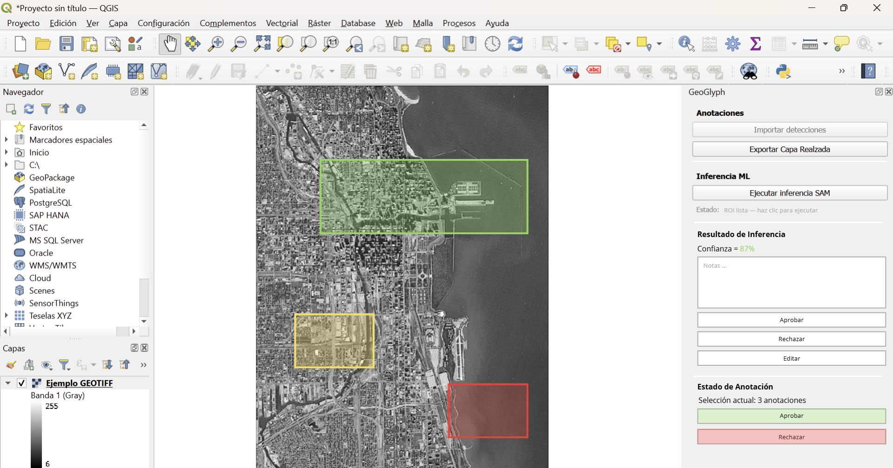

# GeoGlyph — Plataforma de Anotación Asistida para Geoglifos


Plugin para QGIS que integra machine learning en flujos de anotación arqueológica, desarrollado para el Centro Nacional de Inteligencia Artificial (CENIA) en colaboración con el equipo de Estudios Aplicados de Antropología UC (EAA_UC).

---

## Descripción

GeoGlyph extiende el entorno GIS con herramientas especializadas para la visualización, anotación y validación de sitios arqueológicos en imágenes aéreas georreferenciadas. El sistema implementa un flujo **human-in-the-loop** que combina inferencia automática con revisión experta, permitiendo generar datasets arqueológicos estructurados y trazables.

El plugin está diseñado para trabajar sobre ortomosaicos de alta resolución (hasta 40.000 × 40.000 px) y apoya el trabajo de arqueólogos con imágenes provenientes de drones, satélites y modelos digitales de elevación (DEM).

---

## Funcionalidades

### ✅ Anotación asistida por ML
- Selección de regiones de interés sobre capas raster para ejecutar inferencia automática (SAM u equivalente).
- Visualización de resultados como capas georreferenciadas.
- Refinamiento iterativo de segmentaciones.
- Conversión de máscaras a polígonos vectoriales editables.

### 🎨 Realce arqueológico de imágenes
- Aplicación de técnicas de procesamiento de imágenes usadas en arqueología (color ramps, decorrelation stretch, DStretch, entre otras).
- Comparación de visualizaciones side-by-side con navegación sincronizada (zoom y pan).

### 📋 Anotaciones estructuradas para flujos de ML
- Importación de resultados de modelos de detección previamente ejecutados (vectoriales y/o probability maps).
- Flujo de aprobación, rechazo y refinamiento de anotaciones dentro del entorno GIS.
- Trazabilidad de anotaciones por origen (`ml-annotation`, `human-annotation`) y estado de validación.
- Exportación en formatos estándar compatibles con pipelines de ML.

---

## Requisitos del sistema

| Componente | Versión mínima |
|------------|----------------|
| QGIS | 3.16 (LTR) |
| Python | 3.8+ |
| Sistema operativo | Windows 10 / Ubuntu 20.04 / macOS 11 |

### Dependencias Python
```bash
pip install -r requirements.txt
```

Las dependencias principales incluyen: `rasterio`, `shapely`, `opencv-python`, `torch`, `onnxruntime`, `fastapi`, `uvicorn`, `pytest`.

---

## Instalación

### Opción 1 — Desde ZIP (recomendado)

1. Descarga el archivo `.zip` desde la sección [Releases](https://github.com/JaviL13/Taller-de-Integracion-G09/releases) o desde los artefactos del pipeline CI.
2. Abre QGIS.
3. Ve a **Plugins → Administrar e instalar complementos → Instalar desde ZIP**.
4. Selecciona el archivo descargado y haz clic en **Instalar complemento**.
5. Activa el plugin desde **Plugins → GeoGlyph**.

### Opción 2 — Desde el código fuente
```bash
# Clonar el repositorio
git clone https://github.com/JaviL13/Taller-de-Integracion-G09.git

# Copiar el plugin a la carpeta de plugins de QGIS
# Linux/macOS:
cp -r Taller-de-Integracion-G09 ~/.local/share/QGIS/QGIS3/profiles/default/python/plugins/geoglyph

# Windows:
# Copiar la carpeta a:
# C:\Users\<usuario>\AppData\Roaming\QGIS\QGIS3\profiles\default\python\plugins\geoglyph
```

Luego activa el plugin desde QGIS en **Plugins → Administrar e instalar complementos**.

---
## Setup para desarrolladoras

Sigue estos pasos **una sola vez** para tener el plugin funcionando en tu QGIS local.

### 1. Instalar QGIS

Descarga e instala QGIS 3.16 LTR o superior desde [qgis.org](https://qgis.org/es/site/forusers/download.html).

### 2. Clonar el repositorio

```bash
git clone https://github.com/JaviL13/Taller-de-Integracion-G09.git ~/Desktop/Taller-de-Integracion-G09
```

### 3. Crear el symlink hacia la carpeta de plugins de QGIS

**Mac/Linux:**
```bash
ln -s ~/Desktop/Taller-de-Integracion-G09 ~/Library/Application\ Support/QGIS/QGIS3/profiles/default/python/plugins/GeoGlyph
```

**Windows:**
```bash
mklink /D "%APPDATA%\QGIS\QGIS3\profiles\default\python\plugins\GeoGlyph" "%USERPROFILE%\Desktop\Taller-de-Integracion-G09"
```

> Con el symlink, cualquier cambio que hagas en el repo se refleja directamente en QGIS sin copiar archivos.

### 4. Instalar Plugin Reloader en QGIS

1. Abre QGIS
2. Ve a **Complementos → Administrar e instalar complementos**
3. En **Configuración**, activa "Mostrar también complementos experimentales"
4. Busca `Plugin Reloader` e instálalo

### 5. Activar el plugin GeoGlyph

1. En el gestor de complementos, ve a la pestaña **Instalado**
2. Busca `GeoGlyph` y activa la casilla
3. El plugin debería aparecer en **Raster → GeoGlyph**

### 6. Instalar pre-commit (una sola vez)

```bash
pip install pre-commit
pre-commit install
```

Esto configura un hook que ejecuta **ruff** automáticamente antes de cada `git commit`, corrigiendo el formato y reportando problemas de estilo sin necesidad de recordarlo manualmente.

Para correr los hooks manualmente sobre todos los archivos:
```bash
pre-commit run --all-files
```

Para actualizar los hooks a las últimas versiones:
```bash
pre-commit autoupdate
```

---

### Flujo de trabajo diario

1. Edita los archivos en el repo normalmente
2. En QGIS, recarga el plugin con **Complementos → Plugin Reloader → Reload Plugin: GeoGlyph**
3. Los cambios se reflejan sin necesidad de reiniciar QGIS
4. Cuando el cambio funciona, haz commit — pre-commit aplicará ruff automáticamente

---

## Configuración inicial

### Backend de inferencia (opcional)

Para instrucciones detalladas de instalación y ejecución del backend SAM, consulte [backend/README.md](backend/README.md).

El plugin puede conectarse a un servidor FastAPI que ejecute MobileSAM (una implementación ligera de SAM). A continuación se detallan los requisitos y los pasos recomendados para instalar y ejecutar el backend localmente.

Recomendación general:
- Use un entorno virtual (venv o conda) para aislar dependencias.
- Si dispone de GPU NVIDIA y quiere aceleración, instale CUDA y los paquetes de PyTorch compatibles antes de instalar el resto de dependencias.

1) Crear y activar un entorno virtual

```bash
# desde la raíz del repositorio
cd backend
python -m venv .venv
# macOS / Linux
source .venv/bin/activate
# Windows (PowerShell)
.\.venv\Scripts\Activate.ps1
```

2) Instalar PyTorch (GPU opcional)

- Si necesita soporte GPU (Linux/Windows con NVIDIA), siga las instrucciones oficiales de PyTorch para instalar la rueda correcta compatible con su versión de CUDA: https://pytorch.org/get-started/locally/
- Ejemplo (CPU-only):

```bash
# CPU-only (ejemplo):
pip install "torch>=2.2.2" "torchvision>=0.17.2" --index-url https://download.pytorch.org/whl/cpu
```

Instalar PyTorch con la opción apropiada antes de instalar el resto de dependencias evita que pip elija una rueda no deseada.

3) Instalar las demás dependencias del backend

```bash
pip install -r requirements.txt
```

Nota: `backend/requirements.txt` incluye una dependencia directa a MobileSAM (`mobile-sam @ https://github.com/ChaoningZhang/MobileSAM/...`) —pip descargará el paquete desde GitHub automáticamente.

4) (Opcional) Usar un checkpoint local

El wrapper de SAM (`backend/sam_wrapper.py`) usa `MODEL_PATH = None` por defecto, lo que permite que MobileSAM descargue automáticamente los pesos si es necesario. Si dispone de un checkpoint local prefiriera usarlo:

- Cree una carpeta `backend/models/` y coloque allí el archivo de checkpoint.
- Edite la constante `MODEL_PATH` en `backend/sam_wrapper.py` y ponga la ruta relativa, por ejemplo `models/mobilesam_checkpoint.pth`.

5) Ejecutar el servidor

```bash
uvicorn main:app --host 0.0.0.0 --port 8000 --reload
```

Endpoints útiles:
- Health: `http://localhost:8000/health`
- Info: `http://localhost:8000/info`
- API docs: `http://localhost:8000/docs`

6) Prueba rápida del endpoint `/infer`

Ejemplo con `curl` (envía una imagen PNG y recibe la máscara en base64):

```bash
curl -X POST "http://localhost:8000/infer" -F "image=@/ruta/a/tu/roi.png" -s | jq .
```

7) Dependencias en el entorno de QGIS

Para que el plugin (`sam_client.py`) pueda enviar solicitudes HTTP al backend desde dentro de QGIS, el intérprete de Python que usa QGIS debe disponer del paquete `httpx`. En sistemas donde QGIS usa su propio entorno Python, instale `httpx` dentro del entorno de QGIS o asegúrese de que QGIS utilice un intérprete que tenga `httpx` instalado.

Problemas comunes y notas de sistema
- `rasterio` y otras dependencias geoespaciales requieren librerías nativas (GDAL). En macOS/Ubuntu use Homebrew/apt para instalar `gdal` antes de crear el entorno virtual si pip falla al compilar ruedas.
- En macOS con chips Apple Silicon (M1/M2), use Python y ruedas compatibles; consulte la documentación de PyTorch y OpenCV para builds en ARM.
- Si desea usar GPU, asegúrese de que los drivers NVIDIA y la versión de CUDA instalados en el sistema coincidan con la rueda de PyTorch que instale.

En el panel del plugin, configure la URL del servidor: `http://localhost:8000`.

> Si el servidor no está disponible, el plugin mantiene todas sus funcionalidades de visualización, importación y anotación manual sin degradar el flujo principal.

---

## Uso básico

1. Abre QGIS y carga una imagen raster georreferenciada (GeoTIFF).
2. Activa el panel de GeoGlyph desde **Plugins → GeoGlyph**.
3. **Para anotar con ML:** Selecciona una región de interés y ejecuta la inferencia. Revisa, refina y convierte el resultado a polígono.
4. **Para revisar detecciones:** Importa un archivo de detecciones (`.geojson` o probability map `.tiff`) y usa el panel de validación para aprobar, rechazar o editar cada candidato.
5. **Para realce visual:** Agrega capas de realce desde el menú de visualización y compara configuraciones en modo side-by-side.
6. Exporta las anotaciones validadas desde **GeoGlyph → Exportar anotaciones**.

---

## Dataset de demostración

El repositorio incluye un dataset de demostración en `data/demo/` con:
- Ortomosaico de baja resolución del sitio Cerro Unita (`demo_ortomosaico.tif`)
- Anotaciones de ejemplo en formato GeoJSON (`demo_annotations.geojson`)
- Detecciones sintéticas para probar el flujo de validación (`demo_detections.geojson`)

---

## Pipeline CI/CD

El proyecto utiliza **GitHub Actions** con un pipeline de 3 etapas:

| Stage | Herramienta | Descripción |
|-------|-------------|-------------|
| `lint` | ruff, pylint | Linting y verificación de formato del código Python |
| `test` | pytest, pytest-cov | Pruebas unitarias con reporte de cobertura |
| `build` | zip, importlib | Empaquetado del plugin y verificación de instalación |

El pipeline se activa automáticamente en cada `push` y `pull_request` a las ramas `main` y `develop`.

---

## Arquitectura
```
┌─────────────────────────────────────┐
│           QGIS (Frontend GIS)       │
│  ┌──────────────────────────────┐   │
│  │     GeoGlyph Plugin (PyQGIS) │   │
│  │  - Panel de anotación        │   │
│  │  - Importación de resultados │   │
│  │  - Realce de imágenes        │   │
│  └──────────┬───────────────────┘   │
└─────────────┼───────────────────────┘
              │ HTTP (REST)
              ▼
┌─────────────────────────────┐
│   FastAPI ML Backend        │
│   - Inferencia SAM/ONNX     │
│   (local o servidor CENIA)  │
└─────────────────────────────┘
              │
              ▼
┌─────────────────────────────┐
│   Persistencia local        │
│   GeoPackage / GeoJSON      │
└─────────────────────────────┘
```

---

## Limitaciones conocidas

- El plugin es un **prototipo funcional** (TRL-3/4), no un sistema productivo.
- La inferencia ML requiere un backend separado; sin él, la segmentación asistida no está disponible.
- No se incluye despliegue en infraestructura cloud (fuera del alcance del proyecto).
- El dataset de demostración usa imágenes de baja resolución; los ortomosaicos reales de EAA_UC no se distribuyen por razones de propiedad intelectual y patrimonio cultural.
- El diseño de datasets de entrenamiento y el fine-tuning de modelos quedan fuera del alcance de este prototipo.

---

## Equipo

Proyecto de Titulación — Grupo 09
Departamento de Ciencia de la Computación, Pontificia Universidad Católica de Chile

Desarrollado para **CENIA** (Centro Nacional de Inteligencia Artificial) en colaboración con **EAA_UC** (Estudios Aplicados de Antropología UC).

**Product Owner:** Francisca Gil — francisca.gil@cenia.cl

**Integrantes:**
- Ana Villar
- Fernanda Godoy
- Amada Saez
- Antonia Riffo
- Javiera Larraín

---

## Licencia

Proyecto académico desarrollado con fines de investigación. Los datos arqueológicos utilizados son propiedad de las instituciones participantes y no se distribuyen públicamente.

---

## Testing

### Correr Tests Localmente

Instala las dependencias de testing antes de correr los tests por primera vez:
```bash
pip install pytest pytest-cov rasterio numpy
```

Si se quiere correr todos los test:
```bash
pytest -v --cov=. --cov-report=term-missing
```

Si se quiere correr solo los test de TIGS-35:
```bash
pytest tests/test_tigs35.py -v --cov=. --cov-report=term-missing
```

---

## Wireframes del flujo de validación

### **Pantalla 1 — Imagen cargada**


### **Pantalla 2 — ROI seleccionada**


### **Pantalla 3 — Panel de decisión**


### **Pantalla 4 — Estado final**

